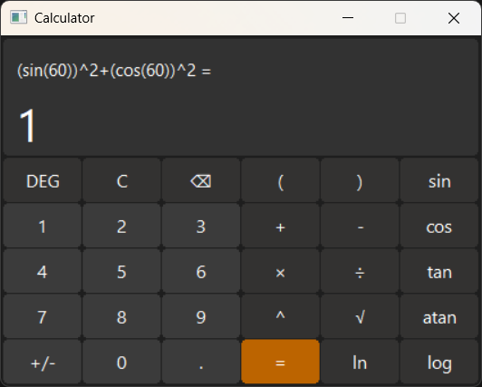
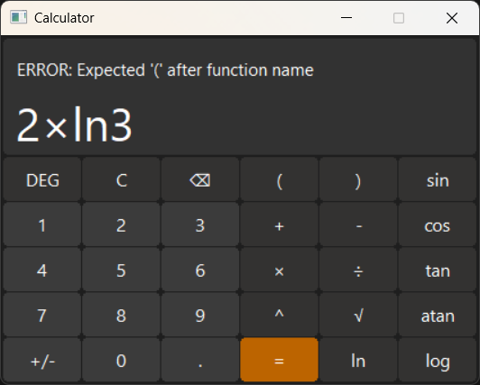

# Calculator (C++ & WinAPI)
A GUI calculator built with WinAPI.

## Features
- **Basic Operations**: `+`, `-`, `×`, `÷`, `=`, `C`
- **Advanced Functions**:
  - Trigonometry: `sin`, `cos`, `tan`, `atan`
  - Logarithms: `log` (base 10), `ln` (natural)
  - Exponents & Roots: `x^y`, `√`
  - Number Handling: `+/-`, `.`
- **Angle Mode Toggle**: Switch between **DEG** (degrees) and **RAD** (radians) for trigonometric calculations
- **Parentheses Support**: `( )`
- **Adaptive UI scaling**: Adjusts to different screen resolutions
- **Error Handling**: Displays clear error messages for invalid input.

## How to build
1. Install CMake and Visual Studio
2. Build:
	```bash
	   cmake -B build
	   cmake --build build --config Release
3. Run `build/bin/Release/Calculator.exe`



